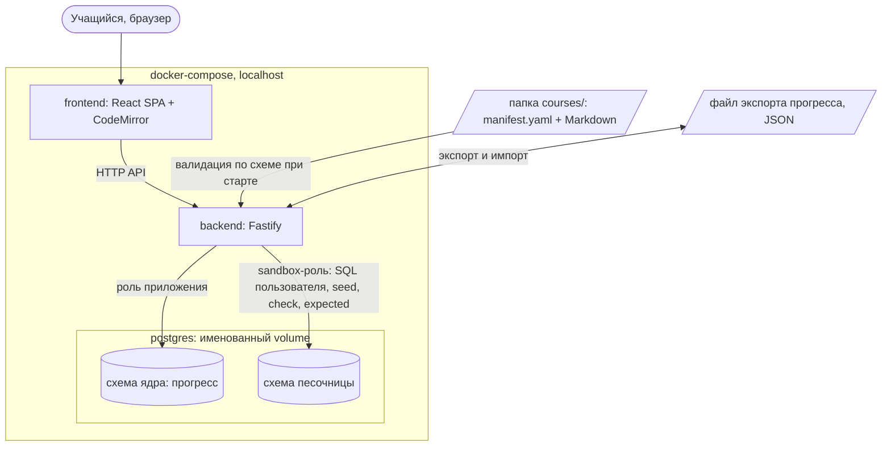

# Архитектура Trellis (MVP)

Весь стек — локальный docker-compose; наружу открыты только порты UI/API на `127.0.0.1`.

## Узлы

- **frontend** — прохождение курса, квизы, встроенный SQL-редактор (CodeMirror); данные только через API backend.
- **backend** — API движка: прогресс, квизы, валидация/подключение контент-пакетов, экспорт/импорт, оркестрация песочницы.
- **postgres** — один инстанс, две изолированные зоны: схема ядра (прогресс) под ролью приложения и схема песочницы под sandbox-ролью с правами только на неё.
- **courses/** — примонтированная директория контент-пакетов; валидируются до показа пользователю.

## Границы (см. `.mvp/invariants.md`)

- frontend никогда не подключается к postgres/песочнице напрямую — только через backend.
- Всё, что исполняется в песочнице (запросы пользователя, seed, check- и expected-запросы курса), идёт от sandbox-роли.
- Ядро не содержит знаний о конкретном курсе; песочница — интерфейс, Postgres — первая реализация.
