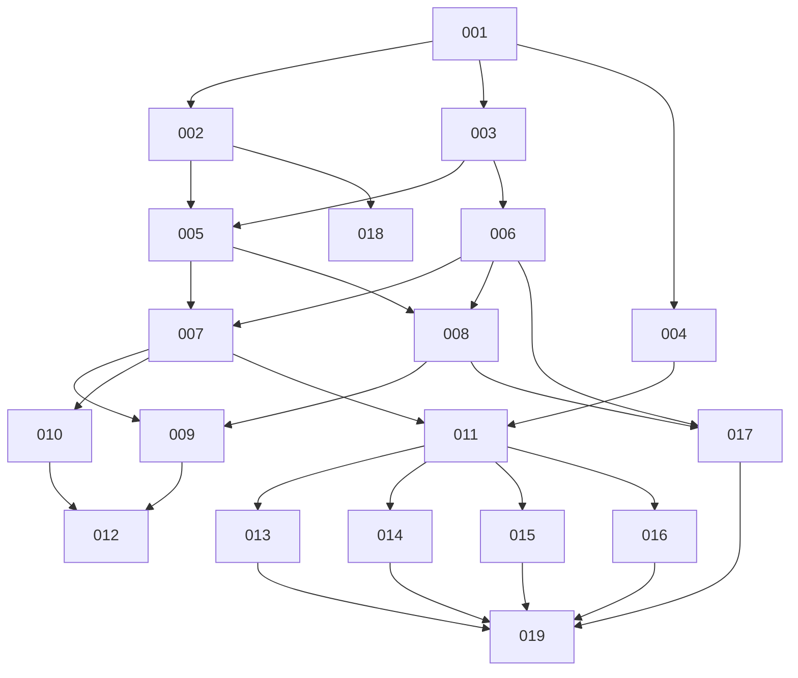

# Project Plan

Автогенерация из `.mvp/plan.json`. **Не редактируй вручную** — правки потеряются. Меняй `plan.json` через `plan-io.mjs`.

## Прогресс
- Всего задач: 19
- Готово: 0 / 19
- Суммарная оценка: 311000 токенов

## Фазы

### Phase 1
- [ ] 001 — Настроить корень монорепозитория: npm workspaces, общий TypeScript/ESLint-конфиг и зеркало CI. (devops-engineer)

### Phase 2
- [ ] 002 — Описать docker-compose стек и инициализацию Postgres: именованный volume, схема ядра под ролью приложения, отдельная схема песочницы под sandbox-ролью с правами только на неё, healthcheck. (devops-engineer)
- [ ] 003 — Поднять скелет backend на Fastify: конфиг, bind на 127.0.0.1, эндпоинт /health, Dockerfile. (backend-implementer)
- [ ] 004 — Поднять скелет frontend: React SPA на Vite + TypeScript, dev-proxy на API backend, Dockerfile и отдача статики. (frontend-implementer)

### Phase 3
- [ ] 005 — Реализовать слой данных ядра: пул соединений под ролью приложения, миграции схемы прогресса и их прогон при старте, корректное закрытие пула на всех путях завершения. (backend-implementer)
- [ ] 006 — Реализовать формат контент-пакета: JSON-схема manifest.yaml, загрузчик директории courses/ с валидацией до показа, чтение Markdown-уроков, реестр курсов в памяти и явное пересканирование. (backend-implementer)

### Phase 4
- [ ] 007 — Реализовать домен прогресса и его API: дерево курса со статусами, отметка «пройдено» вручную и по верному ответу квиза, привязка к стабильным id и согласование прогресса при обновлении курса. (backend-implementer)
- [ ] 008 — Реализовать песочницу практики как интерфейс с Postgres-реализацией: пул под sandbox-ролью, пересоздание схемы, прогон seed-скриптов курса и операция «сбросить песочницу». (backend-implementer)

### Phase 5
- [ ] 009 — Реализовать выполнение практики: запуск пользовательского SQL в песочнице с передачей результата и ошибки Postgres как есть, прогон check-запроса с контрактом «одна строка, один boolean» и самоотметка для заданий без check. (backend-implementer)
- [ ] 010 — Реализовать экспорт и импорт прогресса: версионированный app-level JSON с меткой времени и id/версиями курсов, предупреждение при импорте более старого файла, хранение прогресса неустановленных курсов до их появления. (backend-implementer)

### Phase 6
- [ ] 011 — Собрать каркас SPA: роутинг, типизированный HTTP-клиент к API backend, общий layout и минималистичная тема в мягких зелёных тонах. (frontend-implementer)
- [ ] 012 — Покрыть тестами ядро backend: валидацию контент-пакета, согласование прогресса по стабильным id, изоляцию sandbox-роли, контракт check-запроса и round-trip экспорта/импорта. (test-writer)
- [ ] 017 — Собрать пилотный контент-пакет в courses/: manifest.yaml со стабильными id, Markdown-уроки, квизы, seed-скрипты песочницы и задания практики с check-запросами. (integration-specialist)

### Phase 7
- [ ] 013 — Реализовать навигацию по курсу: список модулей и уроков со статусами, рендер Markdown-контента урока и кнопка явной отметки «пройдено». (frontend-implementer)
- [ ] 014 — Реализовать UI квиза: выбор варианта, подсветка неверного с объяснением, неограниченные попытки и визуальное подтверждение верного ответа. (frontend-implementer)
- [ ] 015 — Реализовать UI практики: встроенный SQL-редактор на CodeMirror, запуск запроса, таблица результата или текст ошибки Postgres как есть, вердикт check-запроса и сброс песочницы. (frontend-implementer)
- [ ] 016 — Реализовать UI переноса прогресса: выгрузка файла экспорта и импорт с предупреждением, если выбранный файл старше локального прогресса. (frontend-implementer)

### Phase 8
- [ ] 018 — Написать отказоустойчивый скрипт запуска для Windows (.ps1/.bat): проверка и ожидание Docker Desktop, docker compose up, ожидание healthcheck Postgres/backend/frontend, вывод готового адреса без открытия браузера. (devops-engineer)
- [ ] 019 — Написать сквозной smoke-тест поднятого стека: курс валидируется и виден, урок и квиз отмечаются пройденными, SQL-практика выполняется в песочнице, экспорт и импорт прогресса дают round-trip. (test-writer)

## Граф зависимостей

